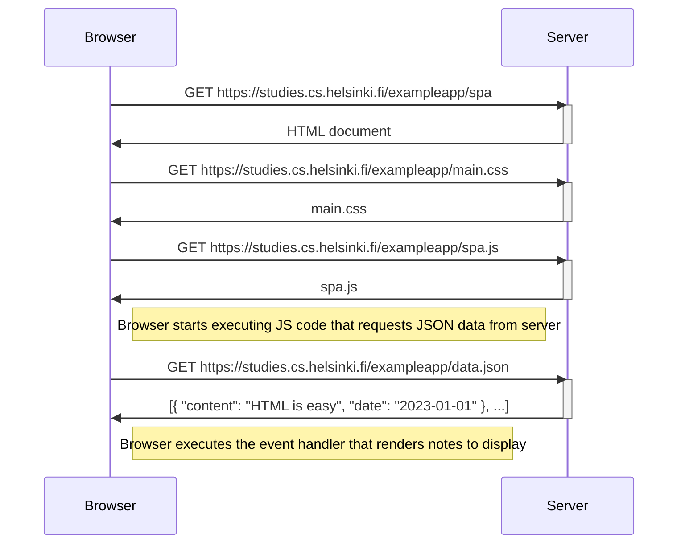

```mermaid
sequenceDiagram
    participant Browser
    participant Server
    
    Browser->>Server: GET https://studies.cs.helsinki.fi/exampleapp/spa
    activate Server
    Server->>Browser: HTML document
    deactivate Server

    Browser->>Server: GET https://studies.cs.helsinki.fi/exampleapp/main.css
    activate Server
    Server->>Browser: main.css
    deactivate Server

    Browser->>Server: GET https://studies.cs.helsinki.fi/exampleapp/spa.js
    activate Server
    Server->>Browser: spa.js
    deactivate Server
    
    Note right of Browser: Browser starts executing JS code that requests JSON data from server 
    
    Browser->>Server: GET https://studies.cs.helsinki.fi/exampleapp/data.json
    activate Server
    Server->>Browser: [{ "content": "HTML is easy", "date": "2023-01-01" }, ...]
    deactivate Server
    
    Note right of Browser: Browser executes the event handler that renders notes to display
```
