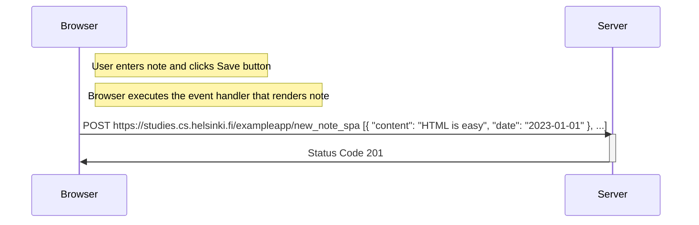

```mermaid
sequenceDiagram
    participant Browser
    participant Server
    
    Note right of Browser: User enters note and clicks Save button

    Note right of Browser: Browser executes the event handler that renders note

    Browser->>Server: POST https://studies.cs.helsinki.fi/exampleapp/new_note_spa [{ "content": "HTML is easy", "date": "2023-01-01" }, ...]
    activate Server
    Server->>Browser: Status Code 201
    deactivate Server
```
